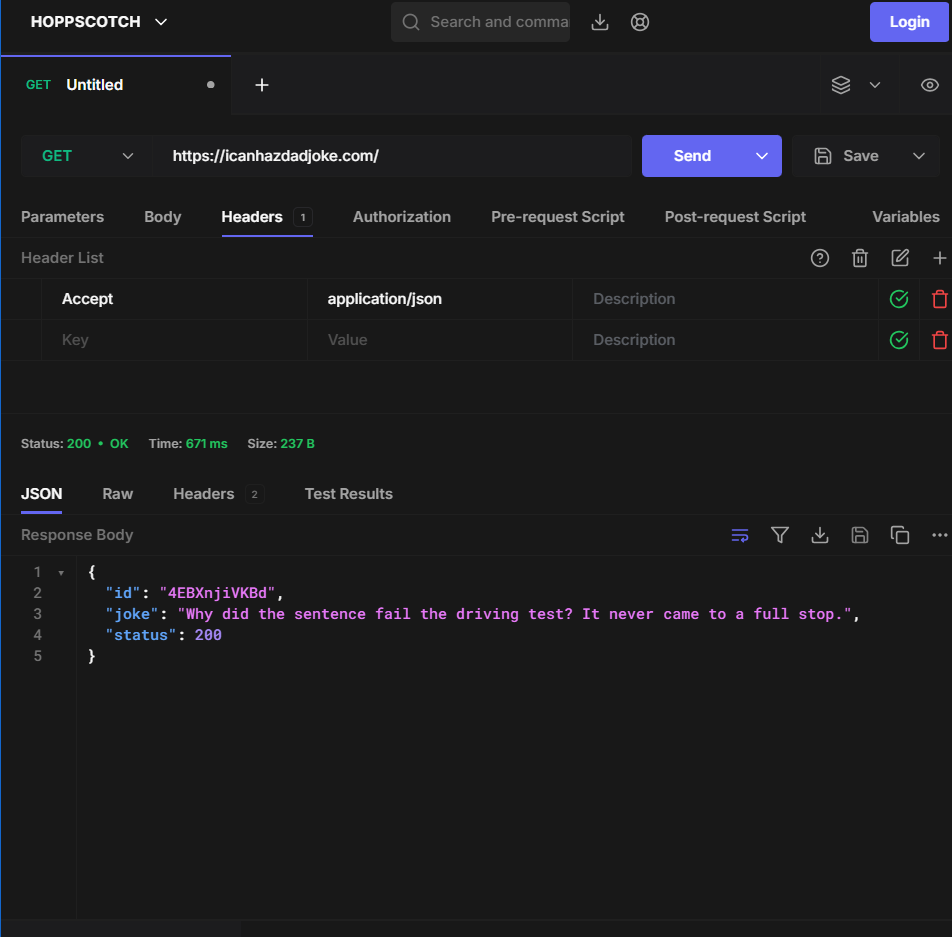

# Async and Await, APIs & HTTP Communication

## Async Functions

- A special type of function that simplifies working with asynchronous operations (like fetching data, reading files, or setting timers). It is a <b>cleaner wrapper around JavaScript Promises</b>, allowing you to write asynchronous code that looks and reads like synchronous code.

### Async Keyword
The async keyword marks a function as asynchronous, enabling it to return a promise and use the await keyword to run non-blocking operations. Also apply then and catch method.

```js
async function greet() {
    return "Hello!";  //Returns a promise
}

let hello = async () => {}; // Returns a promise

CONSOLE

greet();
Promise {<fulfilled>: 'Hello!'}
[[Prototype]]
: 
Promise
[[PromiseState]]
: 
"fulfilled"
[[PromiseResult]]
: 
"Hello!"


Arrow Function
let headingColor = async (color) => {
    heading.style.color = color;
    return "Changed";
}
```

If function is 
- Normal execute then promise is fulfilled + return
- Error/mistake execute then promise is rejected + return

```js
async function greet() {
    throw "this is used to throw error"
    return "Hello!";
}

```

### Await Keyword
 The await keyword in JavaScript is used to <i>pause</i> the execution of an asynchronous function until a Promise settles (either resolves or rejects). It extracts the fulfillment value directly from the Promise, allowing you to write clean, asynchronous code that looks and behaves like readable, synchronous code.

```js
function getNumberAndColor(color, delay) {
    return new Promise((resolve, reject) => {
        
        setTimeout(() => {
            const number = Math.floor(Math.random() * 10) + 1;
            console.log(number);
            heading.style.color = color;
            console.log("Color changed: ", color)
            resolve();
            
        }, delay);
    })
}

async function demo() {
    await getNumberAndColor("darkred", 1000);
    await getNumberAndColor("red", 1000);
    await getNumberAndColor("black", 1000);
    await getNumberAndColor("darkred", 1000);
}
```

### Error Handling With Await

try to write await in try so you could catch error so that the whole code doesn't get paused because of error.

```js
function getNumberAndColor(color, delay) {
    return new Promise((resolve, reject) => {
        
        setTimeout(() => {
            const number = Math.floor(Math.random() * 10) + 1;
            if( number > 5){
                reject("Promise Rejected");
            }
            console.log(number);
            heading.style.color = color;
            console.log("Color changed: ", color)
            resolve();
            
        }, delay);
    })
}

async function demo() {
    try {
        await getNumberAndColor("darkred", 1000);
        await getNumberAndColor("red", 1000);
        await getNumberAndColor("black", 1000);
        await getNumberAndColor("darkred", 1000);
    } catch(error) {
        console.log("Error Caught")
        console.log(error);
    }
    
    let a = 5;
    console.log(a);
    console.log("new number = ", 10)
}
```


## APIs

an API (Application Programming Interface) is a tool that allows your code to communicate with other software, browsers, or external databases to fetch, modify, or display data.

- Think of API as waiter who takes request from us(user JS) and give the food in response prepared in kitchen.

Examples:
Some random APIs
https://catfact.ninja/fact  (sends random cat facts)
https://bored-api.appbrewery.com/random (sends an activity to do when bored)
https://dog.ceo/api/breeds/image/random  (sends cute dog pictures)

API URL (often called an API endpoint) is the specific web address you use to send a request to an external server to fetch, send, or update data.

URL
- Normal(No keys, No cost, limits)
- Paid(Keys, pay as you go, high performance and scale)

## JSON
www.json.org

JSON, which stands for JavaScript Object Notation, is a lightweight, text-based format used for storing and exchanging data. It is essentially a organized way to write down data so that both humans can easily read it and computers can quickly parse it. Despite having "JavaScript" in its name, JSON is completely language-independent and works seamlessly with Python, Java, C++, and almost every other programming language.

<b>JSON object property names must be inside double quotes</b>

So look at:

name: "Glacier"

In JavaScript, that's valid.

In JSON, you need:

"name": "Glacier"

Same for:

age: 19

becomes:

"age": 19

And:

skills: ["JavaScript", "Node.js"]

becomes:

"skills": ["JavaScript", "Node.js"]

Notice that the array doesn't fundamentally change.

```js
{
  "id": 101,
  "name": "Sara",
  "isStudent": false,
  "skills": ["Java", "Python", "SQL"],
  "address": {
    "city": "Hubballi",
    "pincode": 580021
  }
}
```

### Accessing Data from JSON
- Always string form

- JSON.parse(data) Method
To parse a string data into a JS object

JSON is data format, not a JavaScript object.

So:

JSON.stringify(student) // object → string
JSON.parse(jsonStudent) // string → object

```js
const jsonResponse = '{"activity":"Clean out your car","availability":0.08,"type":"busywork","participants":1,"price":0,"accessibility":"Minor challenges","duration":"minutes","kidFriendly":true,"link":"","key":"2896176"}'

const validResponse = JSON.parse(jsonResponse);

console.log(validResponse.activity)
```

- JSON.stringify(json) Method
To parse a JS object data into JSON

```js
const student = {
    name: "Om",
    age: 20,
}
CONSOLE
JSON.stringify(student)
'{"name":"Om","age":"20"}'

const student = {
    name: "Glacier",
    age: 19,
    skills: ["JavaScript", "Node.js"]
};


const jsonStudent = JSON.stringify(student);

const studentObject = JSON.parse(jsonStudent);

console.log(studentObject.skills[1])
```
## Testing API Reqests
Tools

- Hoppscoth

- Postman

## Ajax

 (Asynchronous JavaScript and XML Or now JSON) is a web development programming pattern that allows a web page to send and receive data from a server in the background without refreshing the entire page. By decoupling the data exchange from the page presentation, it makes web applications significantly faster, smoother, and more interactive.

 ## HTTPS
HTTPS is a secure web protocol that uses encryption, certificates, and port 443 to protect data sent between your device and a website.

 ### HTTPS verbs

Examples: 
- GET
- POST
- DELETE
| Request                    | Think                | HTTP verb            |
| -------------------------- | -------------------- | -------------------- |
| 1. Retrieve all books      | Get data             | **GET**              |
| 2. Create a new student    | Create data          | **POST**             |
| 3. Delete a comment        | Remove data          | **DELETE**           |
| 4. Update a user's profile | Modify existing data | **PUT** or **PATCH** |

🧠 Code-reading connection

When you eventually see:

axios.get(url)

read it as:

axios → make an HTTP request → GET → retrieve something from this URL

And:

axios.post(url, data)

read it as:

axios → make an HTTP request → POST → send data to create something

So don't memorize GET = retrieve as an isolated fact. Build the mental chain:

Intent → HTTP verb → Axios method

### Status Codes
HTTP status codes are three-digit numbers sent by a server to a browser or client to indicate the outcome of a request. 
Informational responses (100 – 199)
Successful responses (200 – 299)
Redirection messages (300 – 399)
Client error responses (400 – 499)
Server error responses (500 – 599)

EX:
- 200 OK
- 404 Not Found
- 400 Bad Request
- 500 Internal Server Error


## Add Information in URLs

### Query Strings

https://www.google.com/search?q=apple+airpod

- q is key and apple is value

- ?name=Om&age=20

- url/:id or :num or :q or {{id}} or <id> these are variables, these are replaced by valid values


### Https headers

header, value

example:
Calling the API
Authentication
No authentication is required to use the icanhazdadjoke.com API. Enjoy

API response format
All API endpoints follow their respective browser URLs, but we adjust the response formatting to be more suited for an API based on the provided HTTP Accept header.

Accepted Accept headers:

text/html - HTML response (default response format)
application/json - JSON response
text/plain - Plain text response
Note: Requests made via curl which do not set an Accept header will respond with text/plain by default.



## Our First Request

### Using Fetch

fetch(url)

Fetch API is a modern, built-in global function used to make asynchronous HTTP requests across networks. It replaces the older XMLHttpRequest and relies on Promises, giving you a cleaner syntax to interact with APIs.

```js
let url = "https://catfact.ninja/fact";

fetch(url)
    .then((response) => {
        console.log(response)
        // console.log(response.json()) //This function makes our data readable
        // response.json().then((data) => {
            // console.log(data)
        // })
        return response.json();
    })
    .then((data) =>{
        console.log("fact 1:", data.fact);
        return fetch(url)
    })
    .then((response) =>{
        return response.json();
    })
    .then((data2) => {
        console.log("fact 2:",data2.fact)
    })
    .catch((error) =>{
        console.log("Error: ", error)
    })
```

### Using Fetch with async-await

```js
let url = "https://catfact.ninja/fact";

async function getFacts() {
    try{
        const response1 = await fetch(url);
        const data1 = await response1.json()
        console.log(data1.fact)
        const response2 = await fetch(url);
        const data2 = await response2.json()
        console.log(data2.fact)
    
    } catch(error){
        console.log("Error: ", error)
    }
    // console.log("done")
}
```

## Axios
Library to make HTTP requests

Axios is a popular, promise-based JavaScript library used to make HTTP requests from both the browser and Node.js environments. It serves as a bridge allowing your application to send and receive data from external APIs or servers.

### Why Use Axios?
Developers frequently choose Axios over the native browser fetch() API because it provides cleaner syntax, saves development time, and handles common network tasks automatically.

```js


const url = "https://catfact.ninja/fact";
const url1 = "https://api.thecatapi.com/v1/images/search";

const catButton = document.querySelector("#catButton");
const dogButton = document.querySelector("#dogButton");


catButton.addEventListener("click", async() =>{
    const fact = await getFacts();
    let paragraph = document.querySelector("#result");
    paragraph.innerText = fact
})

async function getFacts() {
    try{
        const response1 = await axios.get(url);
        return response1.data.fact;
    
    } catch(error){
        console.log("Error: ", error)
        return "No Fact Found"
    }
}

dogButton.addEventListener("click", async() =>{
    const link = await getImage()
    const image = document.querySelector("#dogResult")
    image.setAttribute("src", link);
    console.log(link)
})

async function getImage() {
    try{
        const response2 = await axios.get(url1);
        return response2.data[0].url;
    
    } catch(error){
        console.log("Error: ", error)
        return "No Image Found"
    }
}
```

### Sending Headers

```js

const url = "https://icanhazdadjoke.com/";

async function getJokes() {
    try {
        const configuration = {
            headers: {Accept: "application/json"} //I want the server's response in JSON format. Accept is the header name and application/json is the value
        }
        const response = await axios.get(url, configuration);
        console.log(response.data);
    } catch(error) {
        console.log(error)
    }
}
```


### Updating Query Strings

```js
const url = "http://universities.hipolabs.com/search?name=";

const button = document.querySelector("button");

button.addEventListener("click", async () =>{
    let country = document.querySelector("input").value;
    console.log(country)
    getColleges(country);
    let collegesArray = await getColleges(country);
    showColleges(collegesArray)
});

function showColleges(collegesArray) {
    let list = document.querySelector("#list")
    list.innerText = "";
    for(college of collegesArray){
        console.log(college.name);

        let collegeList = document.createElement("li");
        collegeList.innerText = college.name;
        list.appendChild(collegeList);
    }
}

async function getColleges(country) {
    try{
        const response = await axios.get(url + country);
        return response.data;
    } catch(error){
        console.log("Error: ", error);
        return [];
    }
}
```


MORE EXAMPLES

1. 
```js

function saveToDb(data) {
    return new Promise((resolve, reject) => {
        const number = Math.floor(Math.random() * 10) + 1;
        
        if (number > 4) {
            resolve(`${data} saved`);
        } else {
            reject("Weak Connection");
        }
    });
}

async function saveDate(){
    try{
        await saveToDb("Student");
        console.log("Data 1 saved");
        await saveToDb("Course");
        console.log("Data 2 saved");
        await saveToDb("Marks");
        console.log("Data 3 saved");
        console.log("All data saved successfully");
    } catch(error) {
        console.log("Database Error: ", error);
    }
} 

saveDate();
```


Read it like English:

saveData()
  ↓
try:
  save Student
  wait
  save Course
  wait
  save Marks
  wait
  say everything succeeded

if ANY save rejects
  ↓
catch
  ↓
Database Error
<i>
One other thing: async isn't needed on saveToDb() because that function already returns a Promise. The function containing the awaits, saveData(), is the one that needs async.
</i>